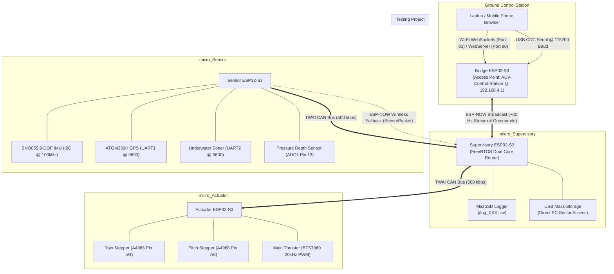
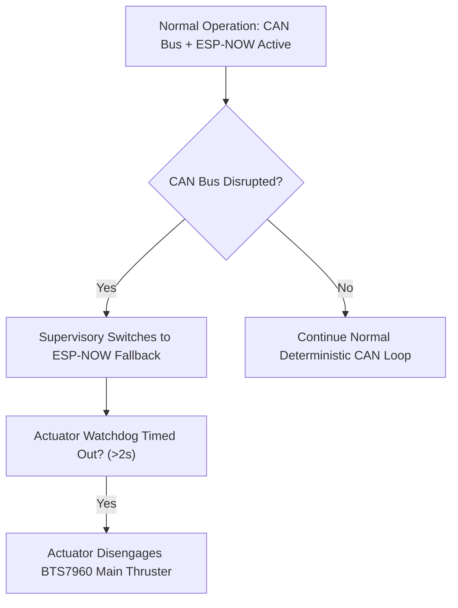

# Exhaustive System Architecture & Engineering Manual
## Autonomous Underwater Vehicle (AUV) Embedded System Suite

Welcome to the comprehensive technical reference and operational manual for the Autonomous Underwater Vehicle (AUV) embedded electronics, sensor fusion engine, motor control network, data logging pipeline, and 3D web ground station suite.

---

## 1. System Engineering Overview

The AUV system utilizes a **distributed multi-microcontroller architecture** powered by four (4) ESP32-S3 32-bit dual-core processors running FreeRTOS. High-speed deterministic control and telemetry are transmitted across an onboard **TWAI CAN Bus (500 kbps)**, backed up by an **ESP-NOW Wireless Mesh (2.4 GHz)** and connected to a ground station via **USB Serial** and **Wi-Fi WebSockets**.



---

## 2. Microcontroller Nodes & Hardware Breakdown

### Node 1: `micro_Sensor` (Navigation & Perception Engine)
* **Primary Role**: Acquires data from a 9-DOF IMU, a multi-GNSS receiver, an underwater ultrasonic transducer, and an analog pressure depth sensor.
* **Firmware Path**: [`micro_Sensor/src/main.cpp`](file:///c:/Users/MP2KC/OneDrive/Documents/PlatformIO/Projects/micro_Sensor/src/main.cpp)
* **Configuration**: [`micro_Sensor/platformio.ini`](file:///c:/Users/MP2KC/OneDrive/Documents/PlatformIO/Projects/micro_Sensor/platformio.ini)

#### Component Deep Dive & Mathematics
1. **BNO055 9-DOF IMU (I2C)**: Connected to I2C bus (`SDA: GPIO 38`, `SCL: GPIO 39`) operating at 100 kHz. Reads absolute orientation (Euler angles: Pitch, Roll, Yaw) fused via an internal ARM Cortex-M0 core.
2. **ATGM336H GPS Receiver (UART1)**: Connected to Hardware Serial 1 (`RX: GPIO 17`, `TX: GPIO 18`) at 9600 baud. Parsed continuously using `TinyGPS++` for Latitude, Longitude, Altitude, Speed, HDOP, Satellites, and UTC time.
3. **Underwater Ultrasonic Sonar (UART2)**: Connected to Hardware Serial 2 (`RX: GPIO 16`, `TX: GPIO 15`) at 9600 baud. Parses 4-byte binary frames `[0xFF, High, Low, Checksum]` where:
   $$\text{Checksum} = (0\text{xFF} + \text{High} + \text{Low}) \pmod{256}$$
   $$\text{Distance (mm)} = (\text{High} \ll 8) \mid \text{Low}$$
4. **4-20 mA Pressure Depth Sensor (ADC1)**: Submersible pressure transducer connected to ADC1 pin `GPIO 13` with 11dB attenuation (0–3.3V range) and 12-bit resolution (0–4095). Applies an 8-sample moving average filter:
   $$V_{\text{avg}} = \frac{1}{8} \sum_{i=1}^{8} \text{ADC}_i \times \frac{3.3}{4095}, \quad \text{Depth (mm)} = V_{\text{avg}} \times \frac{5000.0}{3.3}$$
5. **TWAI CAN Transceiver (MCP2551)**: Interfaced with ESP32-S3 TWAI controller on `TX: GPIO 5` and `RX: GPIO 4` running at 500 kbps with queue length set to 15 frames.

| Peripheral / Sensor | Interface | Pin Definitions | Notes |
| :--- | :--- | :--- | :--- |
| **CAN Bus Transceiver (MCP2551)** | TWAI / CAN | `TX: GPIO 5`, `RX: GPIO 4` | 500 kbps, Queue Len: 15, Auto-recovery |
| **BNO055 9-DOF IMU** | I2C (`Wire`) | `SDA: GPIO 38`, `SCL: GPIO 39` | 100 kHz I2C Clock, Addr `0x28` |
| **ATGM336H GPS** | UART1 (`GPS`) | `RX: GPIO 17`, `TX: GPIO 18` | 9600 Baud NMEA via `TinyGPS++` |
| **Underwater Sonar** | UART2 (`SonarSerial`) | `RX: GPIO 16`, `TX: GPIO 15` | 9600 Baud, 4-Byte Checksum Frame |
| **Analog Depth Sensor** | Analog ADC1 | `SENSOR_PIN: GPIO 13` | 12-bit ADC, 11dB, 8x Oversampled |
| **Status LED** | NeoPixel | `RGB_LED_PIN: GPIO 48` | Native WS2812B RGB Status LED |

---

### Node 2: `micro_Actuator` (Motor Control & Propulsion)
* **Primary Role**: Vectors control surfaces (Yaw and Pitch steppers) and drives main thruster DC motor via high-frequency PWM.
* **Firmware Path**: [`micro_Actuator/src/main.cpp`](file:///c:/Users/MP2KC/OneDrive/Documents/PlatformIO/Projects/micro_Actuator/src/main.cpp)
* **Configuration**: [`micro_Actuator/platformio.ini`](file:///c:/Users/MP2KC/OneDrive/Documents/PlatformIO/Projects/micro_Actuator/platformio.ini)

#### Component Deep Dive
1. **A4988 Stepper Motor Drivers**: Driven via step/direction interface.
   * Stepper 1 (Yaw Axis): `STEP1: GPIO 5`, `DIR1: GPIO 4`.
   * Stepper 2 (Pitch Axis): `STEP2: GPIO 7`, `DIR2: GPIO 6`.
   * Step generation uses microsecond delays (`MIN_STEP_DELAY_US = 400us`) with FreeRTOS task yielding every 20 steps.
2. **BTS7960 43A DC Motor Driver (Main Thruster)**: Interfaced with ESP32 LEDC PWM controller at 20 kHz (above audible frequencies) with 8-bit resolution (0–255).
   * `RPWM: GPIO 21` (Forward Motion PWM).
   * `LPWM: GPIO 47` (Reverse Motion PWM).
   * Enable pins `R_EN` and `L_EN` tied to 3.3V via hardware jumpers.

#### FreeRTOS Dual-Task System on Core 1
* `canTask` (Priority 5, Core 1): Polls TWAI buffer every 5ms. Parses CAN target positions (`0x200`), thruster speed (`0x201`), and homing targets (`0x203`). Transmits status telemetry (`0x202`) every 200ms.
* `actuatorTask` (Priority 4, Core 1): Executes non-blocking stepper step pulses, updates BTS7960 PWM, and enforces a **2.0-second CAN timeout failsafe**.

> [!IMPORTANT]
> **Actuator Protection Failsafes**:
> 1. **CAN Lost Failsafe**: If no valid CAN packet is received for $> 2.0$ seconds (`CAN_TIMEOUT_MS`), `actuatorTask` forces `targetBtsSpeed = 0`, bringing the main thruster to an immediate stop.
> 2. **Task Watchdog Timer (TWDT)**: Configured with a 5-second panic timeout (`esp_task_wdt`) to force MCU reset upon thread starvation or infinite loop lockup.

---

### Node 3: `micro_Supervisory` (Flight Computer & Data Router)
* **Primary Role**: Executes supervisory logic, routes network traffic between CAN and ESP-NOW, logs high-speed telemetry to MicroSD, and presents a USB Mass Storage interface to external PCs.
* **Firmware Path**: [`micro_Supervisory/src/main.cpp`](file:///c:/Users/MP2KC/OneDrive/Documents/PlatformIO/Projects/micro_Supervisory/src/main.cpp)
* **Configuration**: [`micro_Supervisory/platformio.ini`](file:///c:/Users/MP2KC/OneDrive/Documents/PlatformIO/Projects/micro_Supervisory/platformio.ini)
* **HTML Dashboard**: [`micro_Supervisory/auv_dashboard.html`](file:///c:/Users/MP2KC/OneDrive/Documents/PlatformIO/Projects/micro_Supervisory/auv_dashboard.html)

#### FreeRTOS 5-Task Execution Schedule

| Task Name | Priority | CPU Core | Stack Size | Core Function |
| :--- | :--- | :--- | :--- | :--- |
| `canTask` | 5 (Highest) | Core 1 | 4096 B | Decodes incoming CAN frames (`0x100`–`0x105`, `0x202`). |
| `sdLogTask` | 4 | Core 1 | 4096 B | Non-blocking CSV writer consuming `sdLogQueue`. |
| `broadcastTask` | 3 | Core 0 | 3072 B | Transmits ESP-NOW telemetry packets at $\sim$60 Hz. |
| `espNowTask` | 2 | Core 0 | 3072 B | Handles direct ESP-NOW fallback sensor packets. |
| `systemMonitorTask` | 1 (Lowest) | Core 0 | 3072 B | Watchdog feeder and LED status state machine. |

> [!TIP]
> **USB Mass Storage Device (MSC) Subsystem & Auto-Safety Lock**:
> `micro_Supervisory` implements native USB Mass Storage (`USBMSC` class). When connected via USB to a PC, external OS drivers execute raw sector reads/writes (`onMscRead`, `onMscWrite`) directly to the MicroSD card over FSPI SPI (`CS: 6`, `SCK: 7`, `MOSI: 15`, `MISO: 16`). An auto-safety interlock (`lastMscAccessTime`) pauses MCU SD writes for 3 seconds whenever host PC sector activity occurs, preventing FAT filesystem corruption. Logs auto-increment per session (`/log_001.csv`, `/log_002.csv`...).

---

### Node 4: `Testing` (Ground Bridge Node & Control Station)
* **Primary Role**: Wireless ground bridge connecting vehicle network to laptop or mobile web browsers.
* **Firmware Path**: [`Testing/src/main.cpp`](file:///c:/Users/MP2KC/OneDrive/Documents/PlatformIO/Projects/Testing/src/main.cpp)
* **Embedded Header**: [`Testing/src/dashboard_html.h`](file:///c:/Users/MP2KC/OneDrive/Documents/PlatformIO/Projects/Testing/src/dashboard_html.h)

#### Networking Infrastructure
* **Wi-Fi Dual Mode (`WIFI_AP_STA`)**: Configures Wi-Fi Soft Access Point:
  * **SSID**: `AUV-Control-Station`
  * **Password**: `12345678`
  * **IP Address**: `192.168.4.1`
* **HTTP WebServer (Port 80)**: Serves single-page HTML/JS/CSS dashboard GUI (`DASHBOARD_HTML`).
* **WebSocket Server (Port 81)**: Real-time bi-directional telemetry streaming and command reception (`WebSocketsServer`).
* **USB CDC Serial Bridge**: Transmits raw JSON telemetry over USB Serial at 115200 baud while accepting ground commands.

---

## 3. Node LED Diagnostics Matrix (GPIO 48 RGB NeoPixel)

Each node features a native WS2812B RGB NeoPixel connected to **GPIO 48** for non-blocking visual hardware diagnostics:

| Node | LED Color & Pattern | System State / Condition | Operational Meaning |
| :--- | :--- | :--- | :--- |
| **`micro_Sensor`** | **Solid RGB Boot Test / Off** | Setup Complete / Idle Loop | System initialized; sensor acquisition loop active. |
| **`micro_Actuator`** | **Green Heartbeat** (500ms toggle) | `canConnected == true` | CAN bus online & healthy; motor control active. |
| **`micro_Actuator`** | **Fast Red Blink** (70ms toggle) | `canConnected == false` | CAN offline / timeout ($>2\text{s}$); main thruster stopped. |
| **`micro_Supervisory`** | **Green Flash** (1s cycle, 50ms pulse) | `LED_STATE_OK_CAN` | System operating normally via TWAI CAN bus. |
| **`micro_Supervisory`** | **Blue Flash** (1s cycle, 50ms pulse) | `LED_STATE_OK_ESPNOW` | CAN down ($>3\text{s}$); active on ESP-NOW wireless fallback. |
| **`micro_Supervisory`** | **Fast Red Pattern** (100ms burst, 1s rest) | `LED_STATE_ERR_CAN_TIMEOUT` | Critical connection timeout (neither CAN nor ESP-NOW healthy). |
| **`micro_Supervisory`** | **Blinking White** (500ms toggle) | `LED_STATE_ERR_SD_FAIL` | MicroSD card initialization or mount failure. |
| **`Testing` (Bridge)** | **Cyan Flash** (30ms pulse) | Packet RX (`BPKT_SENSOR` / Raw) | Sensor telemetry packet received over ESP-NOW. |
| **`Testing` (Bridge)** | **Green/Yellow Flash** (30ms pulse) | Packet RX (`BPKT_ACTUATOR`) | Actuator status report packet received over ESP-NOW. |
| **`Testing` (Bridge)** | **Purple/Magenta Flash** (30ms pulse) | Packet TX (`BPKT_COMMAND`) | Control command packet transmitted over ESP-NOW to vehicle. |
| **`Testing` (Bridge)** | **Pulsing Red Error** (150ms pulse, 1.5s) | Packet Error / Corrupted | Mismatched packet length, header error, or corrupted data. |

---

## 4. Telemetry & Messaging Specification

### A. CAN Bus Message Dictionary (500 kbps)

| CAN ID | Source | DLC | Payload Byte Mapping & Data Types |
| :--- | :--- | :--- | :--- |
| `0x100` | `micro_Sensor` | 8 B | B0: `seq`, B1: Health Bitfield, B2: Heap (KB), B3: TX Errors, B4–7: Uptime (ms). |
| `0x101` | `micro_Sensor` | 8 B | B0–3: `float depthMm` (Analog pressure depth in mm). |
| `0x102` | `micro_Sensor` | 8 B | B0–3: `float latitude`, B4–7: `float longitude`. |
| `0x103` | `micro_Sensor` | 8 B | B0–1: `uint16 speed*10`, B2–3: `int16 altM`, B4: `sats`, B5: `hdop*10`, B6: `hour`, B7: `minute`. |
| `0x104` | `micro_Sensor` | 8 B | B0–1: `int16 pitch*100`, B2–3: `int16 roll*100`, B4–5: `int16 yaw*100`. |
| `0x105` | `micro_Sensor` | 8 B | B0–3: `float distanceMm` (Underwater sonar distance in mm). |
| `0x200` | Supervisory | 8 B | B0–3: `int32_t step1` (Yaw Target), B4–7: `int32_t step2` (Pitch Target). |
| `0x201` | Supervisory | 1 B | B0: `int8_t btsSpeed` (-100% reverse to +100% forward). |
| `0x202` | Actuator | 8 B | B0–3: `int32_t pos1` (Yaw Current Pos), B4–7: `int32_t pos2` (Pitch Current Pos). |
| `0x203` | Supervisory | 1 B | B0: `uint8_t axis` (`0x00`=Both, `0x01`=Yaw, `0x02`=Pitch homing reset). |

---

### B. ESP-NOW Binary Protocol Definition

```cpp
#define BPKT_SENSOR   0x01  // Supervisory -> Bridge Sensor Telemetry
#define BPKT_ACTUATOR 0x02  // Supervisory -> Bridge Actuator Status
#define BPKT_COMMAND  0x03  // Bridge -> Supervisory Command Structure

struct __attribute__((packed)) BridgeSensorPkt {
  uint8_t  type;         // = BPKT_SENSOR (0x01)
  uint32_t sequence;     // Packet Sequence Counter
  float    depthMm;      // Analog Depth Sensor (mm)
  float    distanceMm;   // Underwater Sonar Distance (mm)
  float    latitude;     // GPS Latitude (deg)
  float    longitude;    // GPS Longitude (deg)
  float    pitch;        // BNO055 Pitch Angle (deg)
  float    roll;         // BNO055 Roll Angle (deg)
  float    yaw;          // BNO055 Yaw / Heading (deg)
  uint8_t  imuValid;     // BNO055 Health Flag
  uint8_t  gpsValid;     // GPS Fix Health Flag
  uint8_t  uwValid;      // Ultrasonic Sonar Health Flag
};

struct __attribute__((packed)) BridgeActuatorPkt {
  uint8_t  type;         // = BPKT_ACTUATOR (0x02)
  int32_t  pos1;         // Yaw Stepper Motor Step Position
  int32_t  pos2;         // Pitch Stepper Motor Step Position
  int8_t   btsSpeed;     // BTS7960 Motor Speed Percentage (-100 to +100)
};

struct __attribute__((packed)) BridgeCommandPkt {
  uint8_t  type;         // = BPKT_COMMAND (0x03)
  uint8_t  cmdType;      // CMD_STEPPER(1), CMD_BTS(2), CMD_HOME_*(3/4), CMD_MODE(5)
  int32_t  s1;           // Target Step Position 1 (Yaw)
  int32_t  s2;           // Target Step Position 2 (Pitch)
  int8_t   btsSpeed;     // Target Thruster Speed Percentage
  uint8_t  mode;         // 0 = AUTO Mode, 1 = MANUAL Mode
};
```

---

### C. Command & Control Protocol

| Command String | Parameters | Operational Description |
| :--- | :--- | :--- |
| `STEPPER:<s1>:<s2>` | `s1`, `s2` (`int32_t`) | Target step positions for Yaw (`s1`) and Pitch (`s2`). |
| `BTS:<speed>` | `speed` (-100 to +100) | Sets main thruster DC motor speed percentage. |
| `HOME_YAW` | None | Resets Yaw stepper step counter to zero. |
| `HOME_PITCH` | None | Resets Pitch stepper step counter to zero. |
| `MODE:MANUAL` / `MODE:AUTO` | String | Toggles supervisory mode to MANUAL or AUTO. |

---

## 5. Ground Control Station Web Dashboard Engine

The embedded Web Ground Control Station GUI is contained within [`dashboard_html.h`](file:///c:/Users/MP2KC/OneDrive/Documents/PlatformIO/Projects/Testing/src/dashboard_html.h) (and standalone [`auv_dashboard.html`](file:///c:/Users/MP2KC/OneDrive/Documents/PlatformIO/Projects/micro_Supervisory/auv_dashboard.html)).

### Key Software Components
1. **Three.js 3D Vehicle Renderer**: Renders a real-time 3D model of the AUV. Receives Euler angles (`pitch`, `roll`, `yaw`) over WebSocket and updates object rotation matrix:
   $$R = R_z(\text{yaw}) \times R_y(\text{pitch}) \times R_x(\text{roll})$$
2. **Leaflet.js Geospatial Mapping**: Interactive tile-based GPS map with live vehicle position marker, dynamic coordinate polyline path logging, speed display, and satellite status indicators.
3. **Actuator Command Panel**: Interactive sliders for stepper motor step targets and main thruster speed percentages with `HOME_YAW` and `HOME_PITCH` re-zeroing buttons.
4. **Real-Time JSON Terminal Console**: Auto-scrolling telemetry monitor displaying raw JSON packets, connection latency, and packet loss statistics.

---

## 6. System Fail-Safe & Reliability Analysis



---

## 7. MicroSD Data Logging Schema

Data is logged asynchronously in CSV format to `/log_XXX.csv` (e.g., `/log_001.csv`, `/log_002.csv`):
```csv
uptime_ms,source,sequence,depth_mm,uw_distance_mm,lat,lng,alt_m,speed_kmh,pitch,roll,yaw,sats,gps_valid,bno_valid,uw_valid
15420,CAN,142,1250.5,842.0,-6.175412,106.827154,12.5,0.4,2.15,-0.85,142.30,8,1,1,1
```

---

## 8. Quick Start Operational Checklist

1. Power on all four ESP32-S3 nodes. Verify status LEDs glow steady **Green** (or flash Green pulse).
2. Connect PC/Mobile device to Wi-Fi Access Point:
   * **SSID**: `AUV-Control-Station`
   * **Password**: `12345678`
3. Open web browser to `http://192.168.4.1` to view live 3D telemetry, depth gauges, and Leaflet GPS mapping.
